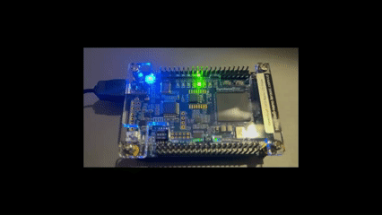
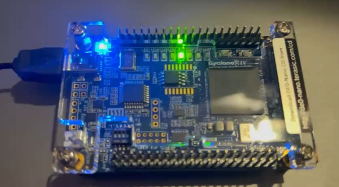

# BorussCPU "Laibach"
```
"Boruss CPU" is an experimental 8 bits RISC CPU with code name "Laibach"
```

## Project description

```
BorussCPU "Laibach" is an experimental 8-bit RISC processor designed in Verilog. The project aims to demonstrate the complete process of CPU design, from architecture and implementation to verification with unit, integration tests and a dedicated assembly compiler BorASM.
```
"BorASM" BorussCPU assembly compiler project link": [https://github.com/jwolak/BorASM](https://github.com/jwolak/BorASM)

### Key features
```
- 8-bit RISC architecture
- Four general-purpose 8-bit registers (reg_a, reg_b, reg_c, reg_d)
- ALU supporting arithmetic and logical operations: ADD, SUB, AND, OR, XOR, NOT, SHL, SHR, JMP, JZ, JNZ, JC, JNC, JN, JP, CMP
- Separate ROM (program) and RAM (data) memory blocks
- FSM-based control unit with states: FETCH, DECODE, EXECUTE, WRITEBACK, FETCH_IMM, HALT
- Flag system: zero (Z), carry (C), negative (N), overflow (O)
- Simple four-stage pipeline for instruction execution
- Testbenches for unit and integration testing (ModelSim compatible)
```

### Code structure
```
- src/core/ – Main CPU modules (ALU, FSM, register file, etc.)
- src/memory/ – ROM and RAM modules
- src/testbench/ – Unit and integration testbenches
- src/program/ - sources and .hex programs that can be loaded to ROM at start up (also built with BorASM)
```

### Dedicated assembly compiler "BorASM"

Visit: [https://github.com/jwolak/BorASM](https://github.com/jwolak/BorASM)

## Example program in ROM

See: [`src/memory/boruss_rom.v`](src/memory/boruss_rom.v)

```sh
        // Always try to load from file
        $readmemh("src/program/knight_rider_two_way_borasm_LED1-LED4.hex", rom_memory);
        $display("Program loaded from src/program/knight_rider_two_way_borasm_LED1-LED4.hex");

        // Check if the first byte is != 0 (program loaded correctly)
        if (rom_memory[0] == 8'h00) begin
            $display("No program file found, using built-in Knight Rider");
            // Default program
            rom_memory[8'h00] = 8'b00000001; // LOAD immediate
            rom_memory[8'h01] = 8'h01;       // Value: 0x01
            rom_memory[8'h02] = 8'b01100000; // SHL
            rom_memory[8'h03] = 8'b01100000; // SHL
            rom_memory[8'h04] = 8'b01100000; // SHL
            rom_memory[8'h05] = 8'b01100000; // SHL
            rom_memory[8'h06] = 8'b01100000; // SHL
            rom_memory[8'h07] = 8'b01100000; // SHL
            rom_memory[8'h08] = 8'b01100000; // SHL
            rom_memory[8'h09] = 8'b10000000; // JMP
            rom_memory[8'h0A] = 8'h00;       // Address
        end else begin
            $display("Program loaded from src/program/knight_rider_two_way_borasm_LED1-LED4.hex");
        end
```
### Demo program (Terasic DE0-Nano Cyclone® IV EP4CE22F17C6N FPGA)



[See source .asm file: `src/program/knight_rider_two_way_borasm_LED1-LED4.asm`](src/program/knight_rider_two_way_borasm_LED1-LED4.asm)

```
MOV R0, #1  ;LOAD immediate value 1 to R0
loop:
SHL R0      ;(LED0->LED1)
SHL R0      ;(LED1->LED2)
SHL R0      ;(LED2->LED3)
SHL R0      ;(LED3->LED4)
SHR R0      ;(LED4->LED3)
SHR R0      ;(LED3->LED2)
SHR R0      ;(LED2->LED1)
SHR R0      ;(LED1->LED0)
JMP loop
```

[See output BorASM .hex file: `src/program/knight_rider_two_way_borasm_LED1-LED4.hex`](src/program/knight_rider_two_way_borasm_LED1-LED4.hex)
```
51
01
60
60
60
60
70
70
70
70
80
02
```

[](media/BorussCPU-Laibach-DE0Nano.gif)

Link: [See BorussCPU Demo program](media/BorussCPU-Laibach-DE0Nano.gif)

### Control signals
```
    ┌─────────────────────────────────────────────────────────────────────────┐
    │                                                                         │
    │  FSM ──────────────────► CPU:                                           │
    │  • instruction_addr     • update_registers                              │
    │  • opcode               • memory_addr                                   │
    │  • dest_reg             • memory_data_in                                │
    │  • src_reg              • memory_write_enable                           │
    │  • is_immediate         • memory_read_enable                            │
    │  • immediate_value      • memory_map_select                             │
    │  • execute_jump         • alu_operation                                 │
    │                                                                         │
    │  CPU ◄──────────────────── ALU:                                         │
    │  • alu_result            • zero_flag                                    │
    │                          • carry_flag                                   │
    │                          • negative_flag                                │
    └─────────────────────────────────────────────────────────────────────────┘
```
### Instruction format
```
    ┌─────────────────────────────────────────────────────────────────────────┐
    │                                                                         │
    │  1-byte instructions:                                                   │
    │  [4-bit opcode][2-bit dest_reg][2-bit src_reg]                          │
    │                                                                         │
    │  2-byte instructions (with immediate):                                  │
    │  [4-bit opcode][4-bit modifier] [8-bit immediate/address]               │
    │                                                                         │
    │  Special:                                                               │
    │  HALT = 0xFF                                                            │
    └─────────────────────────────────────────────────────────────────────────┘
```
### ALU flags
```
    ┌─────────────────────────────────────────────────────────────────────────┐
    │                                                                         │
    │  • zero_flag (Z):      Result equals zero                               │
    │  • carry_flag (C):     Carry out from MSB or borrow in subtraction      │
    │  • negative_flag (N):  Result MSB = 1 (negative in 2's complement)      │
    │  • overflow_flag (O):  Signed arithmetic overflow occurred              │
    └─────────────────────────────────────────────────────────────────────────┘
```
### Execution pipeline
```
    ┌─────────────────────────────────────────────────────────────────────────┐
    │                                                                         │
    │  FETCH ──► DECODE ──► EXECUTE ──► WRITEBACK                             │
    │     │          │                                                        │
    │     │          └──► FETCH_IMM ──┘                                       │
    │     │                                                                   │
    │     └──────────────► HALT                                               │
    └─────────────────────────────────────────────────────────────────────────┘
```
### Execution Pipeline – Timing Diagram
```
    Time:    0    1    2    3    4    5    6    7    8    9   10   11   12   13   14   15
             │    │    │    │    │    │    │    │    │    │    │    │    │    │    │    │
    slow_clk ┌────┐    ┌────┐    ┌────┐    ┌────┐    ┌────┐    ┌────┐    ┌────┐    ┌────┐
             │    └────┘    └────┘    └────┘    └────┘    └────┘    └────┘    └────┘    └─

    CPU      │FETCH│DECODE│EXEC │WRITE│FETCH│DECODE│EXEC │WRITE│FETCH│DECODE│EXEC │WRITE│
    State    │  0  │  1   │  2  │  3  │  0  │  1   │  2  │  3  │  0  │  1   │  2  │  3  │

    PC       ├─ 00h ─────────────────────────┤ 01h ─────────────────────────┤ 02h ────────
             │                               │                              │
```

### Evironment
```
Software:
Quartus Prime 22.1std Build 915 10/25/2022 SC Lite Edition

Hardware:
DE0-Nano FPGA Development and Education Kit [https://www.terasic.com.tw/cgi-bin/page/archive.pl?No=593]
Cyclone® IV EP4CE22F17C6N FPGA
```

## License

**BSD 3-Clause License**
<br/>Copylefts 2025, Janusz Wolak
<br/>No rights reserved